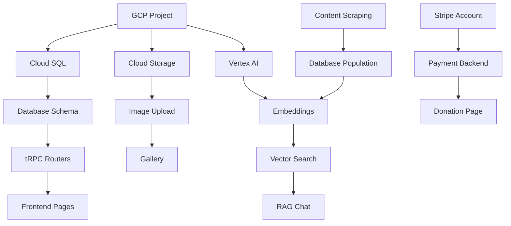

# תוכנית פיתוח מפורטת - אתר "לשון הרע לא מדבר אליי" V2

**גרסה**: 1.0  
**תאריך**: דצמבר 2024  
**מחבר**: ניוקלאוס - מבית THRIVE SYSTEM

---

## סיכום מנהלים

תוכנית פיתוח זו מגדירה את כל שלבי הפיתוח, משימות, תלויות, ולוחות זמנים לבניית אתר V2 לעמותת "לשון הרע לא מדבר אליי". הפרויקט מחולק ל-**4 ספרינטים** של שבועיים כל אחד, עם סך הכל **8 שבועות** לפיתוח מלא.

---

## סטאק טכנולוגי - סיכום

| שכבה | טכנולוגיה | גרסה |
|------|-----------|------|
| **Frontend** | React 19 + TypeScript 5.7 + TailwindCSS 4.0 + Vite 6.0 | Latest |
| **Backend** | Node.js 22 LTS + Express 5 + tRPC 11 | Latest |
| **Database** | Cloud SQL (MySQL 8.4) + Drizzle ORM | GCP |
| **Vector DB** | AlloyDB with pgvector | GCP |
| **AI/ML** | Vertex AI (Gemini 2.0) + Embeddings | GCP |
| **Storage** | Cloud Storage | GCP |
| **Hosting** | Cloud Run (Gen 2) | GCP |
| **CDN** | Cloud CDN + Load Balancer | GCP |
| **Payments** | Stripe | External |
| **Email** | SendGrid / Cloud Tasks | External |

---

## ספרינט 1: תשתית ובסיס (שבועות 1-2)

### שבוע 1: Setup & Database

| יום | משימה | תיאור | תלויות |
|-----|-------|-------|--------|
| 1 | Project Setup | אתחול פרויקט, הגדרות TypeScript, ESLint, Prettier | - |
| 1 | GCP Project | יצירת פרויקט GCP, הפעלת APIs | - |
| 2 | Database Schema | עיצוב וכתיבת סכמת Drizzle מלאה | Day 1 |
| 2 | Cloud SQL Setup | הקמת Cloud SQL instance | GCP Project |
| 3 | Database Migration | הרצת מיגרציות, יצירת טבלאות | Schema |
| 3 | Seed Data | נתוני בסיס ראשוניים | Migration |
| 4 | Auth Setup | הגדרת OAuth, JWT, sessions | Database |
| 4 | tRPC Setup | הגדרת routers בסיסיים | Auth |
| 5 | Testing Setup | Vitest, test utilities | tRPC |
| 5 | CI/CD Setup | Cloud Build, deployment pipeline | GCP |

**Deliverables שבוע 1**:
- [ ] פרויקט מאותחל עם כל התלויות
- [ ] בסיס נתונים פעיל עם כל הטבלאות
- [ ] מערכת אימות עובדת
- [ ] Pipeline CI/CD בסיסי

### שבוע 2: Core Backend & Design System

| יום | משימה | תיאור | תלויות |
|-----|-------|-------|--------|
| 1 | Design System | צבעים, פונטים, spacing, components | - |
| 1 | Rubik Font | הטמעת פונט Rubik | - |
| 2 | UI Components | Button, Card, Input, Modal, etc. | Design System |
| 2 | Layout Components | Header, Footer, Navigation | UI Components |
| 3 | tRPC Routers | content, commitments, contact | Week 1 |
| 3 | Validation | Zod schemas לכל ה-inputs | tRPC |
| 4 | Cloud Storage | הגדרת bucket, upload helpers | GCP |
| 4 | Image Upload | API להעלאת תמונות | Storage |
| 5 | Testing | Unit tests ל-routers | All above |
| 5 | Review | Code review, documentation | All above |

**Deliverables שבוע 2**:
- [ ] Design system מלא
- [ ] רכיבי UI בסיסיים
- [ ] Backend APIs עובדים
- [ ] העלאת תמונות עובדת

---

## ספרינט 2: דפים ראשיים (שבועות 3-4)

### שבוע 3: Homepage & Core Pages

| יום | משימה | תיאור | תלויות |
|-----|-------|-------|--------|
| 1 | Hero Section | גרדיאנט, לוגו, CTA | Design System |
| 1 | Gandhi Quote | סקשן ציטוט עם עיצוב | Design System |
| 2 | Lashon Hara Section | הסבר על לשון הרע | Content |
| 2 | Partnership Cards | 4 כרטיסי שותפות | UI Components |
| 3 | Commitment Form | טופס התחייבות אישית | tRPC |
| 3 | Form Validation | ולידציה + error handling | Form |
| 4 | About Page | דף אודות מלא | Layout |
| 4 | Activities Page | דף הפעילויות | Layout |
| 5 | Contact Page | טופס יצירת קשר | tRPC |
| 5 | Responsive | התאמה למובייל | All pages |

**Deliverables שבוע 3**:
- [ ] דף הבית מלא ועובד
- [ ] טופס התחייבות פעיל
- [ ] דפי About, Activities, Contact
- [ ] רספונסיביות מלאה

### שבוע 4: Gallery & CMS Foundation

| יום | משימה | תיאור | תלויות |
|-----|-------|-------|--------|
| 1 | Gallery Page | תצוגת גלריה | Cloud Storage |
| 1 | Image Grid | רשת תמונות responsive | Gallery |
| 2 | Lightbox | תצוגת תמונה מוגדלת | Gallery |
| 2 | Gallery Categories | סינון לפי קטגוריות | Gallery |
| 3 | Admin Layout | Dashboard layout למנהלים | Auth |
| 3 | Admin Auth | הגנה על routes מנהלים | Auth |
| 4 | Content CMS | עריכת תוכן טקסטואלי | Admin |
| 4 | Image CMS | ניהול תמונות | Admin + Storage |
| 5 | Testing | E2E tests לדפים | All above |
| 5 | Review | Code review, fixes | All above |

**Deliverables שבוע 4**:
- [ ] גלריה מלאה ועובדת
- [ ] ממשק CMS בסיסי
- [ ] ניהול תוכן ותמונות
- [ ] בדיקות E2E

---

## ספרינט 3: תשלומים ו-RAG (שבועות 5-6)

### שבוע 5: Stripe Integration

| יום | משימה | תיאור | תלויות |
|-----|-------|-------|--------|
| 1 | Stripe Setup | הגדרת Stripe account, API keys | - |
| 1 | Stripe Backend | Payment intents, webhooks | Stripe |
| 2 | Donation Page | UI לתרומות | Stripe Backend |
| 2 | Payment Flow | תהליך תשלום מלא | Donation Page |
| 3 | Receipt Generation | יצירת קבלות | Payment |
| 3 | Donation History | היסטוריית תרומות | Database |
| 4 | Webhook Handlers | עדכון סטטוס תשלומים | Stripe |
| 4 | Error Handling | טיפול בשגיאות תשלום | Webhooks |
| 5 | Testing | בדיקות Stripe (test mode) | All above |
| 5 | Security Review | אבטחת תשלומים | All above |

**Deliverables שבוע 5**:
- [ ] מערכת תרומות מלאה
- [ ] תהליך תשלום מאובטח
- [ ] קבלות אוטומטיות
- [ ] Webhooks עובדים

### שבוע 6: RAG System - Phase 1

| יום | משימה | תיאור | תלויות |
|-----|-------|-------|--------|
| 1 | Content Scraping | הורדת תוכן מויקיטקסט/תורת אמת | - |
| 1 | Content Parsing | פרסור וארגון התוכן | Scraping |
| 2 | Database Population | הכנסת תוכן לטבלאות | Parsing |
| 2 | Commentary Import | ייבוא באר מים חיים | Database |
| 3 | Vertex AI Setup | הגדרת Embeddings API | GCP |
| 3 | Embedding Generation | יצירת embeddings לכל התוכן | Vertex AI |
| 4 | Vector Store | הגדרת AlloyDB/pgvector | GCP |
| 4 | Semantic Search | חיפוש סמנטי בסיסי | Vector Store |
| 5 | Testing | בדיקות חיפוש | All above |
| 5 | Optimization | שיפור ביצועים | All above |

**Deliverables שבוע 6**:
- [ ] כל תוכן החפץ חיים בבסיס הנתונים
- [ ] Embeddings לכל התוכן
- [ ] חיפוש סמנטי עובד
- [ ] ביצועים טובים

---

## ספרינט 4: RAG UI & Polish (שבועות 7-8)

### שבוע 7: RAG Chat Interface

| יום | משימה | תיאור | תלויות |
|-----|-------|-------|--------|
| 1 | Chat UI | ממשק צ'אט RTL | Sprint 3 |
| 1 | Message Components | הודעות, citations | Chat UI |
| 2 | RAG Backend | Integration עם Gemini | Embeddings |
| 2 | Context Building | בניית הקשר מהמקורות | RAG Backend |
| 3 | Streaming | תשובות streaming | RAG Backend |
| 3 | Source Links | קישורים למקורות | Streaming |
| 4 | Daily Halacha | הלכה יומית | Database |
| 4 | Topic Browse | דפדוף לפי נושאים | Database |
| 5 | Testing | בדיקות RAG מקיפות | All above |
| 5 | Prompt Tuning | שיפור ה-prompts | Testing |

**Deliverables שבוע 7**:
- [ ] ממשק צ'אט מלא
- [ ] תשובות מבוססות מקורות
- [ ] הלכה יומית
- [ ] דפדוף לפי נושאים

### שבוע 8: Email, Polish & Launch

| יום | משימה | תיאור | תלויות |
|-----|-------|-------|--------|
| 1 | Email Setup | SendGrid/Cloud Tasks | - |
| 1 | Newsletter System | הרשמה וניהול מנויים | Email |
| 2 | Email Templates | תבניות אימייל בעברית | Email |
| 2 | Automated Emails | התראות אוטומטיות | Templates |
| 3 | Performance | Lighthouse optimization | All |
| 3 | SEO | Meta tags, sitemap, robots | All |
| 4 | Security Audit | בדיקת אבטחה מקיפה | All |
| 4 | Bug Fixes | תיקון באגים אחרונים | Audit |
| 5 | Documentation | תיעוד למשתמש ולמפתח | All |
| 5 | Launch Prep | הכנה להשקה | All |

**Deliverables שבוע 8**:
- [ ] מערכת אימיילים מלאה
- [ ] ביצועים מעולים (90+ Lighthouse)
- [ ] אבטחה מאומתת
- [ ] מוכן להשקה

---

## תרשים גאנט

```
Week:    1    2    3    4    5    6    7    8
         |----|----|----|----|----|----|----| 
Sprint 1 |████████|
  Setup  |████|
  Design |    |████|
Sprint 2      |    |████████|
  Pages       |    |████|
  Gallery     |    |    |████|
Sprint 3           |    |    |████████|
  Stripe           |    |    |████|
  RAG-1            |    |    |    |████|
Sprint 4                |    |    |    |████████|
  RAG-2                 |    |    |    |████|
  Polish                |    |    |    |    |████|
```

---

## תלויות קריטיות



---

## משאבים נדרשים

### צוות

| תפקיד | כמות | שעות/שבוע |
|-------|------|-----------|
| Full-Stack Developer | 1-2 | 40 |
| UI/UX Designer | 1 | 20 (שבועות 1-2) |
| DevOps | 1 | 10 |
| QA | 1 | 20 (שבועות 4, 8) |

### שירותי ענן (GCP)

| שירות | הערכת עלות חודשית |
|-------|-------------------|
| Cloud Run | $20-50 |
| Cloud SQL | $50-100 |
| Cloud Storage | $5-10 |
| Vertex AI | $50-100 |
| AlloyDB | $50-100 |
| Load Balancer | $20 |
| **סה"כ** | **$200-400/month** |

### שירותים חיצוניים

| שירות | עלות |
|-------|------|
| Stripe | 2.9% + $0.30 per transaction |
| SendGrid | Free tier (100 emails/day) |
| Domain | ~$15/year |

---

## סיכונים ומיטיגציה

| סיכון | סבירות | השפעה | מיטיגציה |
|-------|---------|--------|----------|
| עיכוב באישור עיצוב | בינונית | גבוהה | אישור מוקדם, iterations |
| בעיות Stripe | נמוכה | גבוהה | Test mode מקיף |
| איכות RAG | בינונית | בינונית | Prompt tuning, feedback loop |
| ביצועים | נמוכה | בינונית | Monitoring, optimization |
| אבטחה | נמוכה | גבוהה | Security audit, best practices |

---

## אבני דרך (Milestones)

| אבן דרך | תאריך יעד | קריטריונים |
|---------|-----------|------------|
| **M1: Infrastructure Ready** | סוף שבוע 1 | DB, Auth, CI/CD עובדים |
| **M2: Design System Complete** | סוף שבוע 2 | כל רכיבי UI מוכנים |
| **M3: Core Pages Live** | סוף שבוע 3 | Home, About, Contact עובדים |
| **M4: CMS Functional** | סוף שבוע 4 | ניהול תוכן עובד |
| **M5: Payments Active** | סוף שבוע 5 | תרומות עובדות |
| **M6: RAG Backend Ready** | סוף שבוע 6 | חיפוש סמנטי עובד |
| **M7: RAG Chat Live** | סוף שבוע 7 | צ'אט AI עובד |
| **M8: Production Launch** | סוף שבוע 8 | אתר מלא בפרודקשן |

---

## Definition of Done

כל משימה נחשבת "Done" כאשר:

1. **קוד** - נכתב, עבר code review, ומורג'
2. **בדיקות** - Unit tests עוברים, coverage > 80%
3. **תיעוד** - JSDoc, README מעודכן
4. **UI** - רספונסיבי, נגיש, RTL תקין
5. **ביצועים** - טעינה < 3 שניות
6. **אבטחה** - ללא vulnerabilities ידועים

---

## הערות סיום

תוכנית זו מהווה מסגרת גמישה. בהתאם לצרכים ולמשוב, ניתן להתאים את סדר העדיפויות ולוחות הזמנים. מומלץ לקיים פגישות סטטוס שבועיות לעדכון ההתקדמות.

---

*מסמך זה הוכן על ידי ניוקלאוס - מבית THRIVE SYSTEM*
